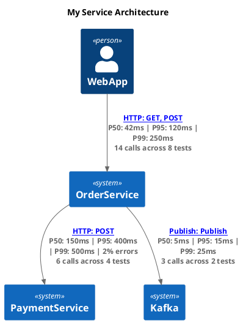

<a name="top"></a>

# Test Tracking Diagrams

Effortlessly autogenerate **PlantUML sequence diagrams** (or **Mermaid sequence diagrams**) from your component and acceptance tests every time you run them. Tracks the HTTP requests between your test caller, your Service Under Test (SUT), and your SUT dependencies, then converts them into diagrams embedded in searchable HTML reports and YAML specification files.

---

## Table of Contents

- [Example Output](#example-output)
- [How It Works](#how-it-works)
- [Use Cases](#use-cases)
- [Deterministic vs AI-Generated Diagrams](#deterministic-vs-ai)
- [Component Diagrams (C4-style)](#component-diagrams)
- [Supported Frameworks & NuGet Packages](#supported-frameworks)
- [Recommended BDD Framework](#recommended-bdd)
- [Documentation](#documentation)

---

## <a name="example-output"></a>Example Output [↑](#top)

[](https://www.plantuml.com/plantuml/uml/j5NDJjj04BvRyZiCBWSGSKa28c2520418PI2258F2A7DxjYnukn6utKYG7so7lf8VONkseO4DnKGgJvvPhwPRtxjtpz_7QMQaSx6YUkiJOX5OmOQrHDeoj1rsgb-JB3ZEl0LfoZrDwKHderedsF6Hn6fJ8eJbIY2Bpn47hPAwvcIkXy_8JGQfUQcW994WaRTA7yOWkqNXdGKomaZDeOPiSdtMEWXxDSDR2tC9DUnah3EBS_6-fGb6MuQ2w7EI8BNpWs1jrMOjZpeUCQCKhpukWxBj9BPU639NSV8N9kSlHEM94WUi1Hu_kewfivOFu9tYccAfE6Qr3GM9KWKoXVT77sYPj17ciOSYsXgLefpJDVs40QaHcMqlAd7kMnpAZ80lrEb2U2yUnl0zZXEHgvJCLhydEqjTAu7VrdOgqlNaNQe54T3xJfbYoDYZvjtfqpZOK_96ZHteCS8clNc7ZJsWjrwK6_0UU_slk9XkP0EBp7LX4dLUajCfY6ItvLSYLX6XtoOoH4A0tITVAqycxONWDTNOtmu8qo73pshSXspBMQWOBDTqWBRWxnxVzVqgS3lZW2ZA5s5t_gzydUjy5dcC54PhKATEyvhpwMFarzVzIqxPoCiWoSOljlMsZ-PQnzhnv8bNxYMmDoQWMuK5sL0MfbDsoppVCYHPamsLBlz-kdgTDxaVimq7ru8cmORx30sE6ZvZHRd_cvJD7qMjfWVYi4-QxA3aDTtoymlP4GeOajWFE-AZzj27RL5JRKZK1a2m7sbxeKYbv_i3QOJ9GMALLPXi5B9vbJ_Pyb7vZN_0_q1003__mC0)

Each test that makes HTTP calls through the tracked pipeline automatically produces a sequence diagram (with matching PlantUML) showing the full request/response flow between services.

> **Tip:** You can visually separate the setup (arrange) phase from the action phase using the [`SeparateSetup`](https://github.com/lemonlion/TestTrackingDiagrams/wiki/Diagram-Customisation#setup-separation) flag.

---

## <a name="how-it-works"></a>How It Works [↑](#top)

```
┌─────────────┐     HTTP      ┌─────────────┐     HTTP      ┌─────────────┐
│  Test Code  │ ──────────►   │     SUT     │ ──────────►   │ Dependency  │
│  (Caller)   │ ◄──────────   │  (Your API) │ ◄──────────   │  (Fakes)    │
└─────────────┘               └─────────────┘               └─────────────┘
       │                             │                             │
       │                             │   Event / Message           │
       │                             │ ──────────────────►  ┌──────┴──────┐
       │                             │                      │Event broker │
       │                             │                      │  (Fakes)    │
       │                             │                      └───────┬─────┘
       │                             │                              │
       └───── All HTTP traffic + events/messages are intercepted ───┘
                                     │
                                     ▼
                          ┌──────────────────────┐
                          │ RequestResponseLogger│
                          │  (in-memory log)     │
                          └──────────┬───────────┘
                                     │
                                     ▼
                          ┌──────────────────────┐
                          │   PlantUmlCreator    │
                          │  or MermaidCreator   │
                          │ (generates diagrams) │
                          └──────────┬───────────┘
                                     │
                                     ▼
                          ┌──────────────────────┐
                          │   ReportGenerator    │
                          │  (HTML + YAML files) │
                          └──────────────────────┘
```

1. **Intercept** — A `TestTrackingMessageHandler` (a `DelegatingHandler`) is inserted into the HTTP pipeline. It logs every request and response, enriching them with tracking headers (test name, test ID, trace ID, caller name). For non-HTTP interactions (events, messages, commands), `MessageTracker` logs them directly to the same in-memory store. See the [Tracking Dependencies](https://github.com/lemonlion/TestTrackingDiagrams/wiki/Tracking-Dependencies) wiki page for a detailed guide on how to configure tracking for every common `HttpClient` pattern.

    > **Important:** These two mechanisms produce visually different diagram output. `TestTrackingMessageHandler` produces proper HTTP-style arrows (with method, status code, headers, body), while `MessageTracker` produces event-style arrows (blue notes, no HTTP semantics). **Always use `TestTrackingMessageHandler` for HTTP-based dependencies** — even if the dependency is faked or stubbed in tests (e.g. via [WireMock](https://github.com/WireMock-Net/WireMock.Net), [JustEat HttpClient Interception](https://github.com/justeattakeaway/httpclient-interception), or in-memory fake APIs). Reserve `MessageTracker` for genuinely non-HTTP interactions like Kafka events or message bus traffic. See the [Tracking Dependencies — Faking Dependencies](https://github.com/lemonlion/TestTrackingDiagrams/wiki/Tracking-Dependencies#faking-dependencies-getting-proper-http-tracking) section for detailed examples.

2. **Collect** — All logged `RequestResponseLog` entries are held in the static `RequestResponseLogger`. Each entry captures the method, URI, headers, body, status code, service names, and a trace ID to correlate requests across services. Events and messages are stored alongside HTTP logs with a distinct `Event` meta type.

3. **Generate** — At the end of the test run, `PlantUmlCreator` (or `MermaidCreator` when using Mermaid output) groups logs by test ID and converts them into sequence diagram code. PlantUML diagrams are encoded and rendered via a PlantUML server (or locally via IKVM); Mermaid diagrams are embedded directly in HTML as `<pre class="mermaid">` blocks rendered client-side by [mermaid.js](https://mermaid.js.org/).

4. **Report** — `ReportGenerator` combines the diagrams with test metadata (features, scenarios, results, BDD steps) to produce three output files: a YAML specification, an HTML specification with diagrams, and an HTML test run report.

---

## <a name="use-cases"></a>Use Cases [↑](#top)

### Debugging failed tests locally and in CI/staging

When a test fails, the sequence diagram shows exactly which HTTP call returned an unexpected response — the status code, headers, and body are all visible in the diagram notes. This eliminates guesswork when diagnosing failures, whether you're debugging locally or triaging a failed CI pipeline run against a staging environment. Instead of adding logging, re-running, and reading through console output, the diagram gives you the full picture in a single image.

### Living documentation for stakeholders, developers, and AI

The generated HTML reports and YAML specifications serve as an always-up-to-date source of truth for how your API behaves. Because they're produced directly from passing tests, they can never drift out of sync with the actual implementation. Stakeholders can browse the HTML reports to understand feature behaviour without reading code. Developers can use them during onboarding or when working in unfamiliar areas of the codebase. AI assistants can consume the YAML specs or PlantUML source to answer questions about service interactions with high accuracy.

### Feeding AI tools for more accurate analysis

The raw PlantUML code behind each diagram is a compact, structured representation of your service's HTTP interactions. You can feed it directly into AI coding assistants, chat interfaces, or documentation generators to give them precise context about how services communicate. This produces significantly better results than asking an AI to infer behaviour from source code alone, because the diagrams capture the actual runtime flow including request/response payloads, status codes, and service names.

### Creating accurate high-level architecture diagrams

The per-test sequence diagrams provide a ground-truth foundation for building higher-level architecture and integration diagrams. Rather than drawing C4 models, system context diagrams, or integration maps from memory (which inevitably drift from reality), you or an AI can derive them from the concrete service interactions captured in the test suite. The PlantUML source is particularly useful here — an AI can aggregate the participants and message flows across multiple test diagrams to produce accurate summary diagrams.

### Reviewing pull requests

When a PR changes HTTP interactions (new downstream calls, modified payloads, changed endpoints), the sequence diagrams in the test reports make the impact immediately visible. Reviewers can compare the before and after diagrams to understand exactly what changed in the service communication, without having to mentally trace through the code.

### Regression detection

If a code change unintentionally alters the HTTP interaction pattern — an extra call to a downstream service, a missing header, a changed payload shape — the updated diagram makes it obvious. The YAML specification files are particularly useful for automated diffing in CI pipelines.

### Onboarding and knowledge transfer

New team members can browse the HTML reports to quickly understand how the system's services interact, what endpoints exist, and what the expected request/response shapes look like — all backed by real, passing tests rather than potentially stale wiki pages.

### CI summary integration

Enable `WriteCiSummary = true` on your `ReportConfigurationOptions` to surface test results and sequence diagrams directly in your **GitHub Actions job summary** or **Azure DevOps build summary**. The summary includes a pass/fail table, and when tests fail, the failed scenarios are shown with error messages, stack traces, and their sequence diagrams — giving you immediate visual context without downloading artifacts. When all tests pass, diagrams for the first N scenarios are shown as a quick validation. An optional interactive HTML artifact (`WriteCiSummaryInteractiveHtml = true`) renders diagrams client-side using the PlantUML JS engine with no server dependency. See the [CI Summary Integration](https://github.com/lemonlion/TestTrackingDiagrams/wiki/CI-Summary-Integration) wiki page for full details.

### CI artifact upload

Enable `PublishCiArtifacts = true` to automatically publish generated report files as CI artifacts. On **Azure DevOps**, reports are uploaded directly via `##vso[artifact.upload]` logging commands during test execution — no additional pipeline configuration needed. On **GitHub Actions**, the library writes the reports directory path and retention days to `$GITHUB_OUTPUT` so you can add a single `upload-artifact` step to your workflow. Artifact retention defaults to 1 day (`CiArtifactRetentionDays`). See the [CI Artifact Upload](https://github.com/lemonlion/TestTrackingDiagrams/wiki/CI-Artifact-Upload) wiki page for configuration and workflow examples.

---

## <a name="deterministic-vs-ai"></a>Deterministic vs AI-Generated Diagrams [↑](#top)

A key advantage of these diagrams is that they are **deterministic** — they are derived directly from actual HTTP traffic captured during test execution, not generated by an AI model. AI-generated diagrams are non-deterministic by nature: they vary between runs, may hallucinate service interactions that don't exist, omit ones that do, or represent payloads inaccurately. The accuracy depends entirely on the model's understanding of your codebase, which is always incomplete.

Because TestTrackingDiagrams captures what actually happened over the wire, the output is a faithful, reproducible record of your system's behaviour. This makes the diagrams and PlantUML source especially valuable as **input to AI tools** — when you give an AI a deterministic, verified diagram as context, it can produce far more accurate outputs for:

- **Debugging** — The AI sees the exact request/response chain that led to a failure, rather than guessing from code paths
- **Code understanding** — The AI can reason about concrete service interactions instead of inferring them from scattered HTTP client registrations and handler code
- **Diagram generation** — The AI can aggregate verified low-level sequence diagrams into accurate high-level architecture diagrams, C4 models, or integration maps
- **Documentation** — The AI can write accurate API behaviour descriptions grounded in real data rather than its own interpretation of the source code

In short: use deterministic diagrams as the source of truth, and let AI tools build on top of that truth rather than trying to reconstruct it.

---

## <a name="component-diagrams"></a>Component Diagrams (C4-style) [↑](#top)

In addition to per-test sequence diagrams, TestTrackingDiagrams can **aggregate all tracked interactions across your entire test suite** to auto-generate a C4-style component diagram. This diagram shows every discovered participant (services, event brokers, databases) and their relationships — giving you a high-level architecture overview derived directly from real test traffic.

This is an **opt-in** feature. Enable it by setting `GenerateComponentDiagram = true` on your `ReportConfigurationOptions`:

```csharp
var options = new ReportConfigurationOptions
{
    GenerateComponentDiagram = true,
    ComponentDiagramOptions = new ComponentDiagramOptions
    {
        Title = "My Service Architecture",
        // Optional: filter out participants you don't want in the diagram
        ParticipantFilter = name => name != "InternalHelper"
    }
};
```

### Output

When enabled, two additional files are generated alongside your existing reports:

| File | Description |
|------|-------------|
| `ComponentDiagram.puml` | Raw PlantUML C4 source — version-controllable, diffable |
| `ComponentDiagram.html` | Interactive HTML page with browser SVG rendering, clickable links, and focus mode |

### Key Features

- **Stats-driven labels** — Relationship arrows show P50 / P95 / P99 latency percentiles, error rates, and call counts
- **Hotspot colouring** — Arrows are colour-coded by P95 latency (green < 50ms, orange 50–200ms, red > 200ms)
- **Low-coverage warnings** — Relationships with few calls use dashed arrows
- **Sortable performance summary table** — Aggregated stats for every relationship with click-to-sort columns and expandable per-endpoint breakdown rows
- **Latency distribution bar chart** — Horizontal bar chart with Mean / P50 / P95 / P99 toggle buttons
- **Latency variance (CV)** — Coefficient of Variation column in the performance table, colour-coded green (consistent) / orange / red (highly variable)
- **Outlier detection** — Automatically flags tests with latency > mean + 2σ, showing a badge in the table and a dedicated section with threshold, count, and top 5 outlier tests
- **Latency contribution** — Stacked bar showing what percentage of total test time each dependency consumes, averaged across all tests
- **Request method distribution** — Colour-coded stacked bars showing GET / POST / PUT / DELETE / PATCH split per relationship (hidden when all calls use the same method)
- **Error correlation** — Pairwise co-occurrence analysis: when relationship A errors, how often does B also error (≥50% threshold)
- **Call ordering patterns** — Aggregates per-test call sequences into patterns like "80% of tests call Auth before Orders" (≥3 samples, ≥60% dominant)
- **Status code distribution** — Per-relationship breakdown of HTTP status codes
- **Payload size analysis** — Request and response mean/P95 payload sizes per relationship
- **Concurrent call detection** — Identifies relationships with overlapping in-flight calls within the same test
- **Interactive focus mode** — Click a service node to dim unrelated nodes (requires `PlantUmlRendering.BrowserJs`)
- **Diff mode** — Compare component diagrams between test runs via `ComponentDiagramDiffer.Compare()`

### Example Output



**How participants are classified:**
- A participant that **only appears as a caller** (never called by another service) is rendered as a `Person()` — typically your test client
- All other participants are rendered as `System()` — your SUT, its dependencies, event brokers, databases, etc.

For full configuration details (custom titles, themes, label formatters, participant filters, diff mode), see the [Component Diagrams](https://github.com/lemonlion/TestTrackingDiagrams/wiki/Component-Diagrams) wiki page.

---

## <a name="supported-frameworks"></a>Supported Frameworks & NuGet Packages [↑](#top)

| Framework | Package | Test Runner | NuGet |
|---|---|---|---|
| **Core library** | `TestTrackingDiagrams` | — | [](https://www.nuget.org/packages/TestTrackingDiagrams) |
| **xUnit v3** | `TestTrackingDiagrams.xUnit3` | xUnit v3 | [](https://www.nuget.org/packages/TestTrackingDiagrams.xUnit3) |
| **xUnit v2** | `TestTrackingDiagrams.xUnit2` | xUnit v2 | [](https://www.nuget.org/packages/TestTrackingDiagrams.xUnit2) |
| **NUnit** | `TestTrackingDiagrams.NUnit4` | NUnit v4 | [](https://www.nuget.org/packages/TestTrackingDiagrams.NUnit4) |
| **MSTest** | `TestTrackingDiagrams.MSTest` | MSTest v3 | [](https://www.nuget.org/packages/TestTrackingDiagrams.MSTest) |
| **BDDfy** | `TestTrackingDiagrams.BDDfy.xUnit3` | xUnit v3 | [](https://www.nuget.org/packages/TestTrackingDiagrams.BDDfy.xUnit3) |
| **LightBDD** | `TestTrackingDiagrams.LightBDD.xUnit2` | xUnit v2 | [](https://www.nuget.org/packages/TestTrackingDiagrams.LightBDD.xUnit2) |
| **LightBDD** | `TestTrackingDiagrams.LightBDD.xUnit3` | xUnit v3 | [](https://www.nuget.org/packages/TestTrackingDiagrams.LightBDD.xUnit3) |
| **ReqNRoll** | `TestTrackingDiagrams.ReqNRoll.xUnit2` | xUnit v2 | [](https://www.nuget.org/packages/TestTrackingDiagrams.ReqNRoll.xUnit2) |
| **ReqNRoll** | `TestTrackingDiagrams.ReqNRoll.xUnit3` | xUnit v3 | [](https://www.nuget.org/packages/TestTrackingDiagrams.ReqNRoll.xUnit3) |

### Extensions

| Extension | Package | Description | NuGet |
|---|---|---|---|
| **CosmosDB** | `TestTrackingDiagrams.Extensions.CosmosDB` | Tracks Azure Cosmos DB SDK operations with classified labels (Create, Read, Query, etc.) and configurable verbosity | [](https://www.nuget.org/packages/TestTrackingDiagrams.Extensions.CosmosDB) |
| **EF Core Relational** | `TestTrackingDiagrams.Extensions.EfCore.Relational` | Tracks SQL operations from any EF Core relational provider (SQL Server, PostgreSQL, MySQL, SQLite, Oracle, Spanner) with classified labels and configurable verbosity | [](https://www.nuget.org/packages/TestTrackingDiagrams.Extensions.EfCore.Relational) |
| **Redis** | `TestTrackingDiagrams.Extensions.Redis` | Tracks StackExchange.Redis operations with cache hit/miss visualization, classified labels (Get, Set, Delete, Hash, List, Set, etc.) and configurable verbosity | [](https://www.nuget.org/packages/TestTrackingDiagrams.Extensions.Redis) |
| **PlantUML IKVM** | `TestTrackingDiagrams.PlantUml.Ikvm` | Local PlantUML rendering via IKVM — no remote server or Java installation required. Supports file-based and inline base64 images | [](https://www.nuget.org/packages/TestTrackingDiagrams.PlantUml.Ikvm) |

All packages from 1.23.X onwards target **.NET 10.0** .

---

## <a name="recommended-bdd"></a>Recommended BDD Framework [↑](#top)

If you're choosing a BDD framework to pair with TestTrackingDiagrams, we recommend **[LightBDD](https://github.com/LightBDD/LightBDD)**.

- **Composite (sub) steps** — LightBDD lets you nest steps inside other steps, creating a hierarchy of abstraction levels. These sub-steps appear in the generated reports, allowing you to read the high-level scenario at a glance and drill down into implementation details only when needed.
- **Pure C#** — Scenarios are plain method calls with refactoring, IntelliSense, and compile-time safety. No `.feature` files to keep in sync.
- **Rich built-in reporting** — LightBDD generates its own HTML reports with step timings, statuses, and categories. TestTrackingDiagrams hooks into this pipeline to embed sequence diagrams directly alongside the scenario results.
- **Parameterised and tabular steps** — First-class support for data-driven steps with inline parameters, verifiable [tabular data](https://github.com/LightBDD/LightBDD/wiki/Advanced-Step-Parameters#tabular-parameters), and [tabular attributes](https://github.com/lemonlion/LightBdd.TabularAttributes), making it easy to express complex test inputs and expected outputs.
- **DI container support** — Native integration with `Microsoft.Extensions.DependencyInjection` and Autofac, which aligns naturally with ASP.NET Core test setups.
- **Active maintenance** — LightBDD is actively maintained with regular releases and good documentation.

That said, all [supported frameworks](#supported-frameworks) work well with TestTrackingDiagrams — pick whichever fits your team best.

---

## <a name="documentation"></a>Documentation [↑](#top)

For full documentation including quick start guides, configuration, customisation, and API reference, see the **[Wiki](https://github.com/lemonlion/TestTrackingDiagrams/wiki)**.

Key pages:
- [Quick Start (xUnit)](https://github.com/lemonlion/TestTrackingDiagrams/wiki/Quick-Start-(xUnit))
- [Framework Integration Guides](https://github.com/lemonlion/TestTrackingDiagrams/wiki/Framework-Integration-Guides)
- [Mermaid Output](https://github.com/lemonlion/TestTrackingDiagrams/wiki/Mermaid-Output)
- [CosmosDB Extension](docs/integration-cosmosdb.md)
- [EF Core Relational Extension](docs/integration-efcore-relational.md)
- [Redis Extension](docs/integration-redis.md)
- [PlantUML IKVM (Local Rendering)](https://github.com/lemonlion/TestTrackingDiagrams/wiki/Integration-PlantUML-IKVM)
- [HTTP Tracking Setup](https://github.com/lemonlion/TestTrackingDiagrams/wiki/HTTP-Tracking-Setup)
- [Diagram Customisation](https://github.com/lemonlion/TestTrackingDiagrams/wiki/Diagram-Customisation)
- [Report Configuration](https://github.com/lemonlion/TestTrackingDiagrams/wiki/Report-Configuration)
- [Component Diagrams (C4-style)](https://github.com/lemonlion/TestTrackingDiagrams/wiki/Component-Diagrams)
- [API Reference](https://github.com/lemonlion/TestTrackingDiagrams/wiki/API-Reference)
- [Example Project](https://github.com/lemonlion/TestTrackingDiagrams/wiki/Example-Project)
